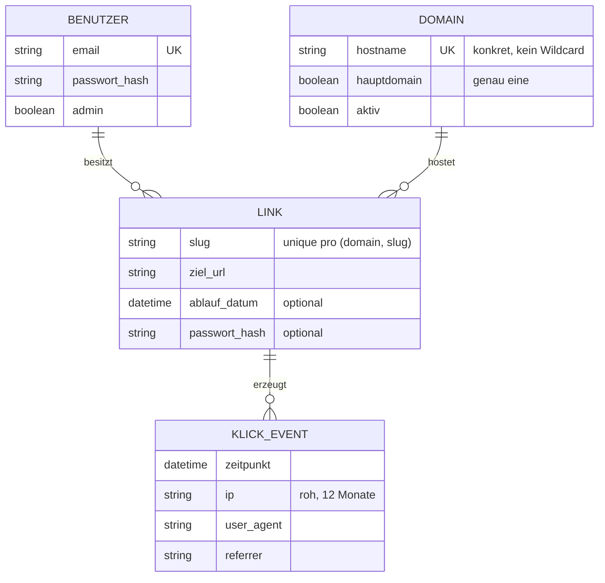

# Domänenmodell

Ergebnis der Grilling-Session vom 2026-07-09. Begriffe: siehe [GLOSSAR.md](GLOSSAR.md).

## Entitäten und Beziehungen

## Invarianten

1. `(domain_id, slug)` ist eindeutig — über alle Benutzer hinweg (geteilte Domains).
2. Ein Slug darf nicht in der Reserved-Slug-Liste stehen (Konfiguration, gilt auf allen Domains).
3. Genau eine Domain ist Hauptdomain; nur sie liefert das Dashboard aus.
4. Ein Link gehört genau einem Benutzer (`owner_id`, Ash attribute-Multitenancy).
5. Benutzer sehen/ändern nur eigene Links; Instanz-Admin alles (Ash Policies).
6. Abgelaufener Link (`ablauf_datum < jetzt`): Redirect antwortet 410, Link bleibt für den Besitzer sichtbar.
7. Unbekannter Host oder unbekannter Slug: 404.
8. Klick-Events älter als 12 Monate werden täglich gelöscht.

## Abläufe

### Redirect (Hotpath, ohne Ash)

1. Request trifft App (Proxy hat TLS terminiert, `x-forwarded-*` gesetzt).
2. Plug im Endpoint: Host gegen Domain-Liste prüfen (Cache) → unbekannt: 404.
3. Hauptdomain + UI-Route/Reserved Slug → an Router durchreichen.
4. `(Host, Slug)` im ETS-Cache nachschlagen (Miss: DB, dann cachen).
5. Abgelaufen → 410. Passwortgeschützt → Interstitial mit Passwortformular.
6. Sonst: 302-Redirect auf Ziel-URL; Klick-Event in Puffer (Batch-Insert asynchron).

### Link anlegen (über Ash)

1. Benutzer wählt Domain (aus Admin-Liste), Slug (custom oder generiert),
   Ziel-URL, optional Ablaufdatum/Passwort.
2. Validierung: Slug-Format, Reserved-Liste, Eindeutigkeit `(domain, slug)`,
   Ziel-URL-Schema (nur http/https).
3. Bei Änderung/Löschung: Cache-Invalidierung für `(Host, Slug)`.

## Bewusst NICHT in v1

- REST-API + API-Keys (später via AshJsonApi nachrüstbar)
- Eigene Kunden-Domains / CNAME (BYOD)
- Organisations-/Team-Mandanten
- Klick-Limit als Ablaufkriterium
- Admin-Audit-Log (AshPaperTrail)
- Offene Registrierung
- GeoIP/Land-Ableitung an Klick-Events (gestrichen 2026-07-09, ADR-0005)
