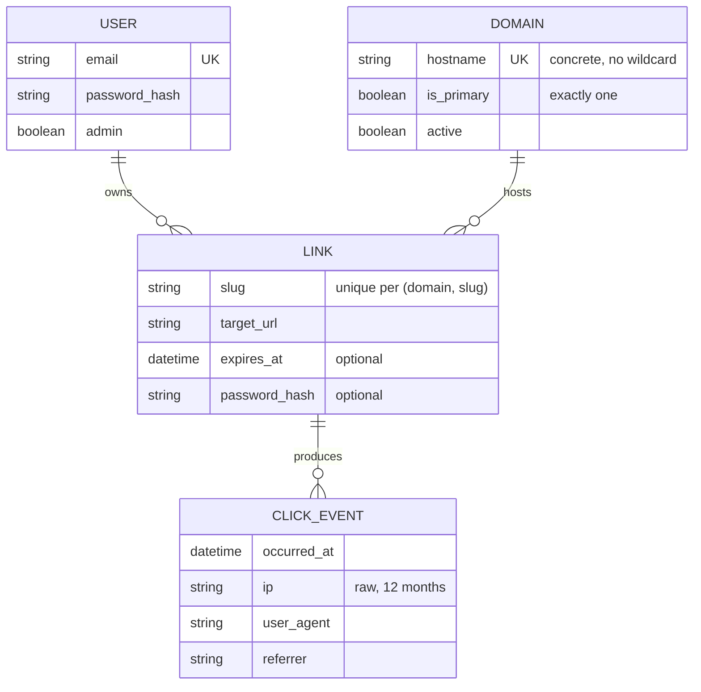

# Domain model

Result of the grilling session on 2026-07-09. Terms: see [GLOSSARY.md](GLOSSARY.md).

## Entities and relationships

## Invariants

1. `(domain_id, slug)` is unique — across all users (shared domains).
2. A slug must not be in the reserved-slug list (configuration, applies to all domains).
3. Exactly one domain is the primary domain; only it serves the dashboard. Its
   hostname follows the `MAIN_DOMAIN` configuration and is synced at boot
   (sentinel row: stable id, links are preserved).
4. A link belongs to exactly one user (`owner_id`, Ash attribute multitenancy).
5. Users see/change only their own links; the instance admin sees everything (Ash policies).
6. Expired link (`expires_at < now`): the redirect responds 410, the link stays visible to its owner.
7. Unknown host or unknown slug: 404.
8. Click events older than 12 months are deleted daily.

## Flows

### Redirect (hot path, without Ash)

1. Request hits the app (proxy has terminated TLS, `x-forwarded-*` set).
2. Plug in the endpoint: check host against the domain list (cache) → unknown: 404.
3. Primary domain + UI route/reserved slug → pass through to the router.
4. Look up `(host, slug)` in the ETS cache (miss: DB, then cache).
5. Expired → 410. Password-protected → interstitial with a password form.
6. Otherwise: 302 redirect to the target URL; click event into a buffer (batch insert, asynchronous).

### Create a link (via Ash)

1. The user picks a domain (from the admin list), a slug (custom or generated),
   a target URL, optionally an expiry date/password.
2. Validation: slug format, reserved list, uniqueness `(domain, slug)`, target
   URL scheme (http/https only).
3. On change/deletion: cache invalidation for `(host, slug)`.

## Deliberately NOT in v1

- REST API + API keys (can be added later via AshJsonApi)
- Own customer domains / CNAME (BYOD)
- Organization/team tenants
- Click limit as an expiry criterion
- Admin audit log (AshPaperTrail)
- Open registration
- GeoIP/country derivation on click events (dropped 2026-07-09, ADR-0005)
